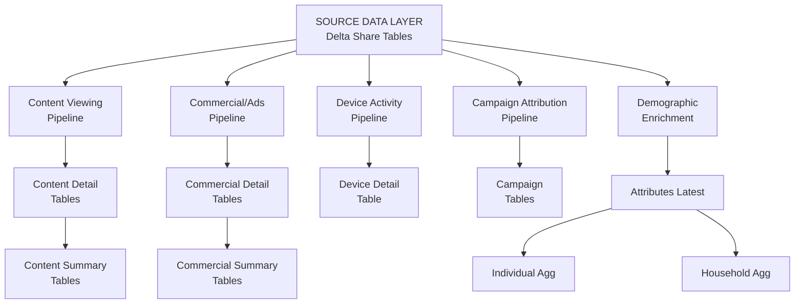

# Akkio - Technical Documentation

## Executive Summary

**TLDR:** Akkio provides comprehensive TV viewing analytics for Vizio devices, enabling audience insights, campaign measurement, and content performance analysis. The platform processes 700GB+ of daily viewing data across 11 curated tables covering content consumption, commercial exposures, device activity, campaign attribution, and demographic profiles.

**Data Scale:** Processing 700GB+ of daily TV viewing data with demographic enrichment from Experian.

---

## Data Model Overview

The platform consists of 11 analytical tables organized into five categories:

### 1. Content Viewing (2 tables)
- `vizio_daily_fact_content_summary` - Daily aggregated content viewing per device
- `vizio_daily_fact_content_detail` - Granular session-level content viewing

### 2. Commercial/Advertisement (2 tables)
- `vizio_daily_fact_commercial_summary` - Daily aggregated ad exposures per device
- `vizio_daily_fact_commercial_detail` - Granular commercial viewing with content context

### 3. Device Activity (1 table)
- `vizio_daily_fact_standard_detail` - Device location and activity sessions

### 4. Campaign Attribution (2 tables)
- `vizio_campaign_nothing_bundt_cakes` - Nothing Bundt Cakes campaign impressions
- `vizio_campaign_farm_bureau_financial_services` - Farm Bureau Financial Services campaign impressions

### 5. Demographics & Household (4 tables)
- `v_akkio_attributes_latest` - Latest demographic attributes from Experian (master demographic table)
- `v_agg_akkio_ind` - Individual-level demographic aggregation for person-based analytics
- `v_agg_akkio_hh` - Household-level demographic aggregation for household-based analytics
- `v_agg_akkio_media` - Individual-level media viewing behavior aggregation

---

## Data Architecture

### High-Level Data Flow

**Pipeline Flow:**
1. **Content Pipeline**: Raw viewing data → enriched with genre/timezone → detail table → daily summary
2. **Commercial Pipeline**: Raw ad data → enriched with categories → detail table → daily summary
3. **Device Pipeline**: Raw device activity → enriched with timezone → detail table
4. **Campaign Pipeline**: Attribution data + population data → campaign impression tables
5. **Demographic Pipeline**: Experian data → decoded attributes → individual & household aggregations

---

## Data Processing & Transformations

### Enrichment & Joins

All pipelines enrich raw source data with reference mappings and location data to provide complete analytical context:

#### Content Viewing Pipeline
- **Genre Enrichment**: Joins episode IDs with `mk_akkio_genre_title_mapping` to add genre classifications to content viewing records. Uses LEFT JOIN, so episodes without genre mappings are still included.
- **Timezone Enrichment**: Joins device hash identifiers with `mk_akkio_tvtimezone_mapping` to add device timezone for local time conversion. Uses LEFT JOIN, so devices without timezone mappings may have NULL timezone values.

#### Commercial/Advertisement Pipeline
- **Commercial Category Enrichment**: Joins creative values with `mk_commercialcategory_mapping` to classify ads into commercial categories (e.g., Automotive, Food & Beverage). Uses LEFT JOIN, so ads without category mappings are included with NULL categories.
- **Timezone Enrichment**: Same timezone mapping join as content pipeline.

#### Device Activity Pipeline
- **Timezone Enrichment**: Joins device hash identifiers with `mk_akkio_tvtimezone_mapping` to add device timezone.

#### Campaign Attribution Pipeline
- **Market Population Enrichment**: Joins attribution records with market population tables (`nothing_bundt_cakes_pop_data_akkio_poc` or `farm_bureau_financial_services_pop_data_akkio_poc`) by market name to add TV population metrics for reach calculations. Uses LEFT JOIN, so impressions without population data are included.
- **Location Enrichment**: Joins with `v_akkio_attributes_latest` by device ID to enrich campaign impressions with latest city, state, and DMA information from device activity data.
- **Timezone Enrichment**: Same timezone mapping join as other pipelines.

#### Demographic Pipeline
- **Location Enrichment**: Joins Experian demographic data with latest location information from `production_r2081_ipage` (device activity table) by device hash. Uses the most recent location record per device (ROW_NUMBER window function) to ensure current geographic attributes. Uses LEFT JOIN, so devices without location history may have NULL geographic fields.

### Data Cleaning & Filtering

#### Content Viewing Tables
- **NULL Device Filtering**: Excludes all records where device hash is NULL to ensure data quality.
- **NULL Title Filtering**: Excludes viewing sessions where show title is NULL, as these cannot be meaningfully analyzed.
- **Minimum Duration Threshold**: Filters out viewing sessions shorter than 10 seconds. This removes brief channel changes, accidental selections, and other non-meaningful viewing events.
- **Text Standardization**: All text fields (networks, titles, genres, callsigns) are standardized to lowercase with spaces replaced by hyphens for consistent matching. Input device names use underscores instead of hyphens. Input categories are converted to uppercase.

#### Commercial/Advertisement Tables
- **NULL Device Filtering**: Excludes all records where device hash is NULL.
- **Duration Validation**: Filters out ads with duration <= 0 seconds to ensure only valid ad exposures are included.
- **Text Standardization**: Brand names and ad titles undergo advanced text cleaning:
  - Removes special characters (quotes, apostrophes)
  - Standardizes separators (spaces, commas, colons, periods) to hyphens
  - Converts to lowercase for consistent matching
  - Commercial categories normalize forward slashes (e.g., "Food / Beverage" → "food/beverage")

#### Device Activity Table
- **NULL Device Filtering**: Excludes all records where device hash is NULL.
- **Deduplication**: Aggregates multiple activity sessions per device per day into a single record. Uses window functions to sum total activity seconds across all sessions for the day, ensuring one row per device per date partition.

#### Campaign Attribution Tables
- **NULL Device Filtering**: Excludes all records where device identifier (`hashed_tvid`) is NULL.
- **Text Standardization**: Show titles, station call signs, and channel affiliates are standardized to lowercase with spaces replaced by hyphens. Show titles also remove special characters (quotes, commas, colons, periods).

#### Demographic Attributes Table
- **NULL Device Filtering**: Excludes all records where device hash is NULL.
- **Household Count Decoding**: Source Experian data contains household-level counts (e.g., "2 males aged 25-34") rather than individual flags. The pipeline decodes these counts into categorical attributes:
  - **Gender**: Determined by presence of any male or female household members (M/F/NULL)
  - **Age**: Uses the first matching age range bucket found in household composition (18, 25, 35, 45, 55, 65)
  - **Ethnicity**: Uses the first matching ethnicity found in household composition
  - **Education**: Uses the highest education level found in household (Graduate > College > Some College > High School)
  - **Income**: Uses the first matching income bracket found (lower bound in thousands)

### Key Assumptions & Business Logic

#### Content Viewing
- **10-Second Threshold**: Sessions shorter than 10 seconds are considered non-meaningful viewing (channel surfing, accidental selections) and are excluded. This threshold balances data quality with capturing genuine viewing behavior.
- **Genre Assignment**: Episodes without genre mappings in the reference table are included but will have NULL genre values. This preserves viewing data even when genre classification is incomplete.

#### Commercial/Advertisement
- **All Valid Ads Included**: Any ad exposure with duration > 0 seconds is included, regardless of length. This captures both 15-second and 30-second spots equally.
- **Category Classification**: Ads without commercial category mappings are included with NULL category values, preserving ad exposure data even when classification is incomplete.

#### Device Activity
- **One Record Per Day**: Multiple activity sessions per device per day are aggregated into a single daily record with total activity seconds summed. This simplifies analysis while preserving total activity duration.

#### Campaign Attribution
- **Market Population Matching**: Population data is joined by market name. If market names don't match exactly between attribution and population tables, impressions will have NULL population values. This may affect reach calculations for unmatched markets.
- **Location Enrichment**: Campaign impressions are enriched with latest known device location from the attributes table. If a device has no location history, geographic fields (CITY, STATE_CODE, DMA) will be NULL.

#### Demographics
- **Household Mapping**: Experian provides household-level demographic counts, but the pipeline coalesces attributes by selecting the first matching demographic characteristic found. This means:
  - If a household has multiple age groups, the youngest age group is selected
  - If a household has multiple ethnicities, the first matching ethnicity is selected
  - Gender reflects presence of any male/female members, not necessarily the primary viewer
- **Latest Location**: Geographic attributes use the most recent device location from activity data. If a device has moved, location reflects the most recent known location, not necessarily the location when demographic data was collected.
- **Source Deduplication**: Source Experian data is already deduplicated at the device hash level, so each device appears once in the source. No additional deduplication logic is applied.

---

## Table Details

### Content Viewing Tables

#### `vizio_daily_fact_content_summary`
**TLDR:** Daily rollup of what content each TV watched - best for aggregate analysis and daily patterns.

**Purpose:** Start here for most content analysis questions. Provides a complete daily view of what each device watched without the overhead of session-level detail.

**Key Fields:**
- `AKKIO_ID` - Unique TV device identifier
- `VIEWED_DATE` - Date content was watched
- `TOTAL_VIEWING_SECONDS` - Total watch time for the day
- `TITLE_STR_LIST`, `GENRE_STR_LIST`, `NETWORK_STR_LIST` - Comma-separated lists of viewed content
- `ZIP_CODE`, `DMA` - Viewing location
- `TIMEZONE` - Device timezone for local time conversion

**Use When:** You need daily aggregates like "total viewing hours per device" or "what genres did each device watch today"

#### `vizio_daily_fact_content_detail`
**TLDR:** Individual viewing sessions with start/end times - use when you need session-level granularity.

**Purpose:** Provides detailed information about each viewing session including exact start/end times, allowing for temporal analysis and session-based queries.

**Key Fields:**
- Same location and device fields as summary
- `SESSION_START_TIME_UTC`, `SESSION_END_TIME_UTC` - Exact session timing
- `TITLE`, `GENRE`, `NETWORK` - Individual content attributes (not lists)
- `PROGRAM_EPISODE_ID` - Episode identifier
- `WATCHED_LIVE` - Live vs recorded indicator

**Use When:** You need session-level detail like "viewing duration by time of day" or "content watched immediately after another show"

---

### Commercial/Advertisement Tables

#### `vizio_daily_fact_commercial_summary`
**TLDR:** Daily rollup of ads each TV was exposed to - best for daily reach and frequency analysis.

**Purpose:** Efficient table for analyzing daily ad exposure patterns, brand reach, and commercial categories without session-level overhead.

**Key Fields:**
- `AKKIO_ID` - Unique TV device identifier
- `VIEWED_DATE` - Date ads were viewed
- `TOTAL_AD_VIEWS` - Number of commercial exposures
- `TOTAL_AD_SECONDS` - Total ad viewing time
- `BRAND_NAME_STR_LIST`, `AD_TITLE_STR_LIST` - Comma-separated lists of ads seen
- `COMMERCIAL_CATEGORY_STR_LIST` - Ad categories viewed
- `CREATIVE_ID_STR_LIST` - Ad creative identifiers

**Use When:** You need daily metrics like "how many ads did each device see" or "daily brand exposure counts"

#### `vizio_daily_fact_commercial_detail`
**TLDR:** Individual ad exposures with surrounding content context - use for co-viewing analysis and ad sequencing.

**Purpose:** Shows exactly when each ad was viewed and what content was being watched before and after the ad, enabling competitive analysis and content-adjacency studies.

**Key Fields:**
- Same device and location fields as summary
- `AD_MATCH_START_TIME_UTC`, `AD_MATCH_END_TIME_UTC` - Exact ad timing
- `BRAND_NAME`, `AD_TITLE`, `CREATIVE_ID` - Ad identification
- `PREV_TITLE`, `PREV_NETWORK` - Content watched before the ad
- `NEXT_TITLE`, `NEXT_NETWORK` - Content watched after the ad
- `COMMERCIAL_CATEGORY` - Ad category classification

**Use When:** You need to know "what content was playing during this ad" or "what other ads appeared in the same break"

---

### Device Activity Table

#### `vizio_daily_fact_standard_detail`
**TLDR:** Device location and activity tracking - use for geographic analysis and device presence verification.

**Purpose:** Tracks where devices are located and when they're active, useful for validating viewing data and understanding geographic distribution.

**Key Fields:**
- `AKKIO_ID` - Unique TV device identifier
- `ACTIVITY_DATE` - Date of activity
- `TOTAL_SECONDS` - Activity duration
- `CITY`, `STATE_CODE`, `ZIP_CODE`, `DMA` - Device location
- `TIMEZONE` - Device timezone

**Use When:** You need location data, device presence validation, or geographic distribution analysis

---

### Campaign Attribution Tables

#### `vizio_campaign_nothing_bundt_cakes`
**TLDR:** Nothing Bundt Cakes campaign impressions with market reach data.

**Purpose:** Track specific campaign ad impressions, enabling reach, frequency, and market penetration analysis for the Nothing Bundt Cakes campaign.

**Key Fields:**
- `AKKIO_ID` - Device that saw the impression
- `IMPRESSION_TIMESTAMP` - Exact time of impression
- `MARKET`, `DMA`, `ZIP_CODE` - Impression location
- `MARKET_TV_POPULATION` - Total market TV population for reach calculations
- `SHOW_TITLE`, `STATION_CALL_SIGN` - Content context during impression
- `LOCAL_OR_NATIONAL` - Broadcast type

**Use When:** Measuring campaign reach, calculating GRPs, or analyzing impression delivery by market

#### `vizio_campaign_farm_bureau_financial_services`
**TLDR:** Farm Bureau Financial Services campaign impressions with market reach data.

**Purpose:** Same structure as Nothing Bundt Cakes table but for Farm Bureau campaign, with additional UE population metric.

**Key Fields:**
- Same fields as Nothing Bundt Cakes campaign
- `MARKET_UE_POPULATION` - Additional population metric for UE reach calculations

**Use When:** Measuring Farm Bureau campaign performance and market penetration

---

### Demographics & Household Tables

#### `v_akkio_attributes_latest`
**TLDR:** Latest demographic profile for each TV device from Experian - the master demographic table.

**Purpose:** Single source of truth for device demographics. Each TV has one row with complete demographic, socioeconomic, and household attributes decoded from Experian data.

**Key Fields:**
- `AKKIO_ID`, `TV_ID`, `AKKIO_HH_ID` - Device and household identifiers
- `GENDER` - M/F
- `AGE` - Age in years (lower bound of range)
- `AGE_BUCKET` - Age range code
- `EDUCATION_LEVEL` - Graduate, College, Some College, High School
- `ETHNICITY` - Ethnicity classification
- `HOUSEHOLD_INCOME_K` - Income in thousands (lower bound)
- `INCOME_BUCKET` - Income range code
- `HOME_OWNERSHIP` - Owner/Renter status (1/0)
- `MARITAL_STATUS` - Married/Single
- `HAS_CHILDREN_0_18`, `HAS_BABIES_0_3` - Presence of children
- `STATE`, `CITY`, `ZIP11`, `DMA_NAME` - Geographic attributes

**Use When:** You need demographic attributes for audience segmentation, targeting, or enrichment

#### `v_agg_akkio_ind`
**TLDR:** Individual-level demographic aggregation - use for person-based audience targeting and analytics.

**Purpose:** Provides simplified individual-level demographic view derived from `v_akkio_attributes_latest`, optimized for audience generation and targeting queries.

**Key Fields:**
- `AKKIO_ID`, `AKKIO_HH_ID` - Individual and household identifiers
- `WEIGHT` - Fixed weighting factor (currently 1)
- `GENDER`, `AGE`, `AGE_BUCKET` - Individual demographics
- `ETHNICITY`, `EDUCATION_LEVEL`, `MARITAL_STATUS` - Additional attributes
- `HOMEOWNER`, `INCOME`, `INCOME_BUCKET` - Household-level attributes
- `MAIDS`, `IPS`, `EMAILS`, `PHONES` - Contact identifier counts (currently placeholders set to 0)

**Use When:** Building individual-level audiences, person-based targeting, or individual demographic analysis

#### `v_agg_akkio_hh`
**TLDR:** Household-level demographic aggregation - use for household-based analytics and targeting.

**Purpose:** Provides household-level demographic view optimized for household-based audience queries and household composition analysis.

**Key Fields:**
- `AKKIO_HH_ID` - Household identifier (unique)
- `HH_WEIGHT` - Fixed weighting factor (currently 1)
- `HOMEOWNER` - Home ownership status (1/0/NULL)
- `INCOME`, `INCOME_BUCKET` - Household income metrics
- `PRESENCE_OF_CHILDREN` - Indicator for children in household

**Use When:** Household-level audience targeting, income bracket analysis, or household composition studies

#### `v_agg_akkio_media`
**TLDR:** Individual-level media viewing behavior aggregation - use for content preference analysis and media-based audience building.

**Purpose:** Aggregates individual viewing behavior into categorical maps (titles, genres, networks) with session counts, enabling efficient content preference queries.

**Key Fields:**
- `AKKIO_ID` - Individual device identifier
- `PARTITION_DATE` - Date partition
- `TITLES_WATCHED`, `GENRES_WATCHED`, `NETWORKS_WATCHED` - Maps of content categories to session counts
- `INPUT_DEVICES_WATCHED`, `APP_SERVICES_WATCHED` - Maps of device/app usage

**Use When:** Analyzing content preferences, building audiences based on viewing behavior, or understanding media consumption patterns

---