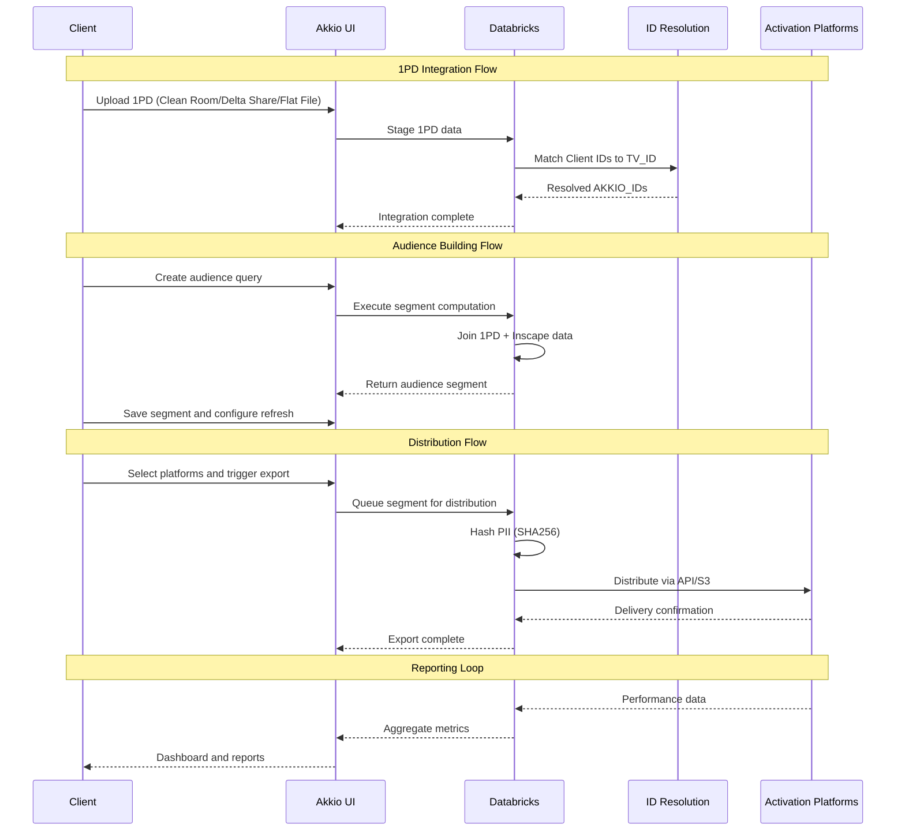

# Vizio DMP Architecture Diagram

## Overview

This document contains architecture diagrams for the Vizio DMP / Audience 1PD Platform.

**Available Formats:**

1. **Architecture SVG** (`vizio_dmp_architecture_figma.svg`) - Full platform architecture, Figma-compatible
2. **Sequence SVG** (`vizio_dmp_sequence_figma.svg`) - Data flow sequence diagram, Figma-compatible
3. **Mermaid Versions** - Below, for easy editing and quick iterations

## How to Use

### SVG in Figma

1. Open Figma
2. File > Import (or drag-and-drop the SVG file)
3. The SVG will be fully editable - you can adjust colors, move boxes, edit text
4. All elements are grouped logically for easy selection

### Mermaid Diagram

Copy the diagram below into:

- [Mermaid Live Editor](https://mermaid.live/)
- GitHub markdown files (renders automatically)
- VS Code with Mermaid extension
- Notion (supports Mermaid)

---

## Architecture Diagram (Mermaid)

```mermaid
flowchart TB
    subgraph AKKIO["Akkio - UI/Workflow Layer"]
        direction TB

        subgraph CLIENT["Client Actions (Self-Serve)"]
            CL1[Client Login<br/>to Akkio Portal]
            CL2[1PD + Inscape<br/>Pre-configured]
            CL3[Query / Filter<br/>Audience Builder]
            CL4[Save Segment<br/>Configure Refresh]

            CL1 --> CL2 --> CL3 --> CL4
        end

        subgraph ADMIN["Akkio / Vizio Admins"]
            AD1[Build Tenant/<br/>Workspace]
            AD2[Configure Data<br/>Mappings]
            AD3[Create Client<br/>Connector]

            AD1 --> AD2 --> AD3
        end

        subgraph BUILD["Audience Build and Explore"]
            BU1[Query UI<br/>Segmentation]
            BU2[Inscape Data<br/>Content/Ads/Demo]
            BU3[Look-Alike<br/>Model LAL]
            BU4[Scaled<br/>Audience]

            BU1 --> BU2 --> BU3 --> BU4
        end

        subgraph DIST_UI["Audience Distribution - via Akkio Orchestration"]
            DU1[Select<br/>Segment]
            DU2[Choose<br/>Platform]
            DU3[Trigger<br/>Export]

            DU1 --> DU2 --> DU3
        end

        subgraph REPORT["Reporting / Dashboarding"]
            RE1[Usage<br/>Metrics]
            RE2[Campaign<br/>Performance]
            RE3[Export<br/>Reports]

            RE1 --> RE2 --> RE3
        end
    end

    subgraph DATABRICKS["Databricks"]
        direction TB

        subgraph INGEST["1PD Ingestion"]
            IN1[Clean Room<br/>Snowflake/AWS]
            IN2[Delta Share<br/>Databricks Native]
            IN3[Flat File<br/>S3/SFTP]
            IN4[Staging<br/>Landing Zone]
            IN5[Data Validation<br/>Schema Check]

            IN1 --> IN4
            IN2 --> IN4
            IN3 --> IN4
            IN4 --> IN5
        end

        subgraph IDRES["ID Resolution"]
            ID1[Client IDs<br/>Email/IP/MAID]
            ID2[ID Matching<br/>TransUnion/LUID Spine]
            ID3[TV_ID Map<br/>Inscape Device Graph]
            ID4[Resolved IDs<br/>AKKIO_ID]

            ID1 --> ID2 --> ID3 --> ID4
        end

        subgraph COMPUTE["Audience Compute"]
            CO1[Inscape Data<br/>Content/Ads/Demographics]
            CO2[Combined<br/>1PD + Inscape Dataset]
            CO3[Segment Compute<br/>dbt/SQL]
            CO4[Audience<br/>Segments]

            CO1 --> CO2 --> CO3 --> CO4
        end

        subgraph DIST["Audience Distribution"]
            DS1[Segment<br/>Queue]
            DS2[ID Hashing<br/>SHA256 PII]
            DS3[Distribution<br/>Router API/S3]

            DS1 --> DS2 --> DS3

            DS3 --> LR[LiveRamp<br/>Connect]
            DS3 --> META[Meta<br/>Hashed PII]
            DS3 --> TTD[Trade Desk<br/>Hashed PII]
            DS3 --> TT[TikTok]
            DS3 --> GOOG[Google<br/>DV360/GAM]
            DS3 --> MAD[Madhive]
            DS3 --> CAD[Cadent]
            DS3 --> FW[Freewheel]
            DS3 --> MAG[Magnite]
            DS3 --> VIZ[VIZIO Ads<br/>Direct]
        end
    end

    %% Cross-layer connections
    CLIENT -.->|1PD Data Flow| INGEST
    BUILD -.->|Query Request| COMPUTE
    DIST_UI -.->|Export Trigger| DIST
    DIST -.->|Performance Data| REPORT

    %% Styling
    classDef primary fill:#4A90E2,stroke:#4A90E2,color:white
    classDef secondary fill:white,stroke:#4A90E2,stroke-width:2px,color:#333
    classDef platform fill:white,stroke:#4A90E2,stroke-width:1px,color:#333

    class CL1,CL3,CL4,AD1,BU1,BU2,BU4,DU1,DU2,RE1,RE2 primary
    class CL2,AD2,AD3,BU3,DU3,RE3 secondary
    class IN1,IN2,IN3,IN4,ID1,ID2,ID3,CO1,CO2,CO3,DS1,DS2,DS3 primary
    class IN5,ID4,CO4 secondary
    class LR,META,TTD,TT,GOOG,MAD,CAD,FW,MAG,VIZ platform
```

---

## Data Flow Sequence (Mermaid)

---

## Component Reference

### ID Types

| ID Type           | Description                    | Usage                             |
| ----------------- | ------------------------------ | --------------------------------- |
| TVID              | Vizio TV identifier            | Core Inscape identifier           |
| Hashed PII        | SHA256 of email, phone, zip    | Distribution to Meta, TTD, etc.   |
| IP Address        | From TV connection             | Linkage to household              |
| Email (hashed)    | From TV registration           | Identity matching                 |
| Encoded Person ID | Tuple of PII information       | Person-level targeting            |
| LUID              | LiveRamp Universal ID          | LiveRamp distribution             |

### Inscape Data Models

| Model                               | Description                    |
| ----------------------------------- | ------------------------------ |
| `vizio_daily_fact_content_detail`   | Session-level content viewing  |
| `vizio_daily_fact_content_summary`  | Daily content aggregates       |
| `vizio_daily_fact_commercial_detail`| Session-level ad views         |
| `vizio_daily_fact_commercial_summary`| Daily ad aggregates           |
| `vizio_daily_fact_standard_detail`  | Device activity                |
| `v_akkio_attributes_latest`         | Demographics from Experian     |
| `v_agg_akkio_hh`                    | Household-level demographics   |
| `v_agg_akkio_ind`                   | Individual-level demographics  |

### Activation Partners

- LiveRamp (Connect) - Primary distribution rail
- Meta - Hashed PII
- The Trade Desk - Includes Walmart Connect
- TikTok
- Google (DV360/GAM)
- Madhive
- Cadent
- Freewheel
- Magnite
- VIZIO Ads (Direct)

---

## File Locations

- Architecture SVG: `docs/vizio_dmp_architecture_figma.svg`
- Sequence SVG: `docs/vizio_dmp_sequence_figma.svg`
- This Markdown: `docs/vizio_dmp_architecture.md`
- Requirements Doc: `vizio_dmp_requirements.md`
